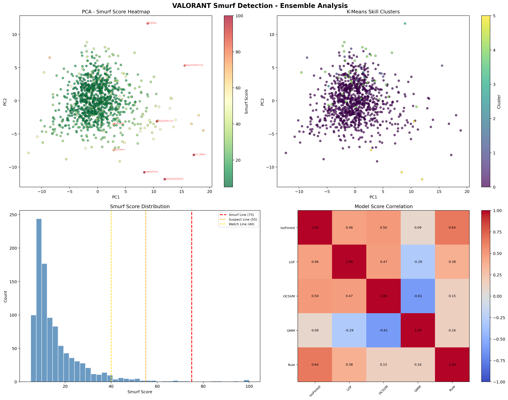
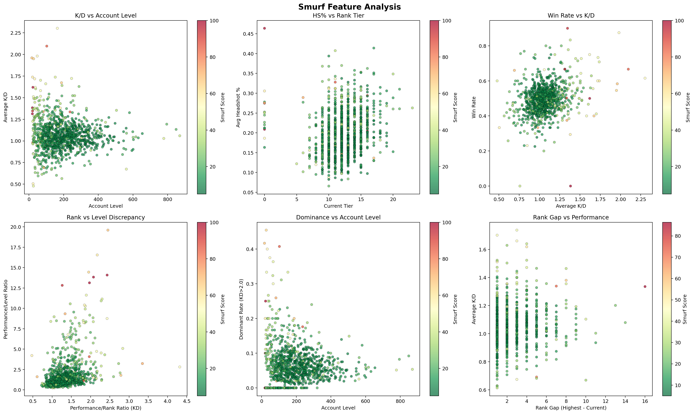
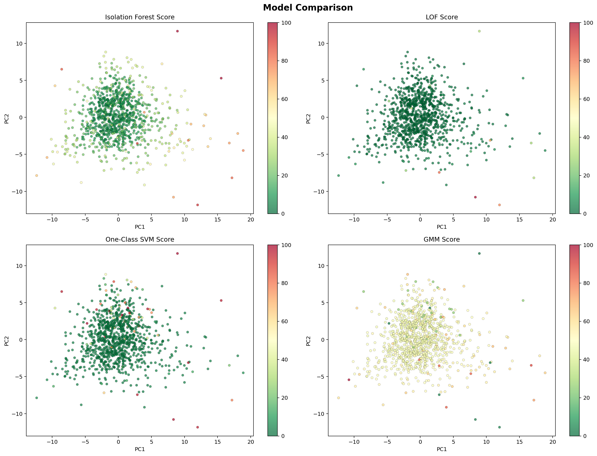

# VALORANT Smurf Detection AI

教師なし学習アンサンブルモデルによるVALORANTスマーフアカウント検出システム。

1002人のプレイヤーデータから **71の特徴量** を抽出し、  
5つの異常検出モデル + ルールベースエンジンを統合して高精度にスマーフを判定します。



---

## 目次

- [概要](#概要)
- [検出結果](#検出結果)
- [アーキテクチャ](#アーキテクチャ)
- [特徴量設計 (71次元)](#特徴量設計-71次元)
- [モデル構成](#モデル構成)
- [ルールベースエンジン](#ルールベースエンジン)
- [パイプライン](#パイプライン)
- [出力ファイル](#出力ファイル)
- [セットアップ](#セットアップ)
- [使い方](#使い方)
- [技術スタック](#技術スタック)

---

## 概要

### スマーフとは？

スマーフとは、高ランクのスキルを持つプレイヤーが**意図的に低ランクの別アカウントを使用**して、格下相手に無双するプレイのこと。公正なマッチメイキングを崩壊させる行為として問題視されています。

### 本プロジェクトのアプローチ

**教師なし学習（Unsupervised Learning）** を採用しています。

「スマーフかどうか」のラベル付きデータは存在しないため、教師あり学習は不可能です。  
代わりに、**正常プレイヤー集団の中から統計的に異常なパターンを示すプレイヤーを検出**するアプローチを取りました。

複数の異常検出アルゴリズムを組み合わせたアンサンブルにより、  
単一モデルでは拾えないスマーフの多面的な特徴を捉えています。

---

## 検出結果

1002人のプレイヤーを分析した結果:

| 判定 | 人数 | 説明 |
|:---|---:|:---|
| 🟢 通常プレイヤー | 846 | 正常な範囲のプレイヤー |
| 🔵 やや疑わしい | 112 | 一部の指標が軽度に異常 |
| 🟡 スマーフ疑い | 28 | 複数の指標で異常を検出 |
| 🟠 スマーフ可能性高 | 10 | 多くのモデルが異常と判定 |
| 🔴 スマーフ濃厚 | 6 | 高い確信度でスマーフと判定 |

### K-Means Silhouette Score: **0.8743**

> Silhouette Score はクラスタリングの品質指標（-1〜1）。0.87は非常に良好な分離を示し、  
> スキル帯ごとの明確な群分けに成功していることを意味します。

### スマーフ検出の典型パターン

| 特徴 | 具体例 |
|:---|:---|
| 低レベル + 高KD | Lv20でKD 1.38、Unratedなのに圧倒的戦績 |
| プレイ期間1シーズン以下 + Platinum到達 | 新規アカウントなのに即座に高ランク |
| 現在ランク Silver ↔ 最高ランク Radiant | ランク乖離が極端 |
| KD 2.0+ + HS%29% | 低ランク帯では異常な精度 |

---

## アーキテクチャ

```
                    ┌─────────────────────┐
                    │   Player JSON Data  │
                    │   (1002 players)    │
                    └────────┬────────────┘
                             │
                    ┌────────▼────────────┐
                    │  Feature Extraction │
                    │  (71 features from  │
                    │   6 data sources)   │
                    └────────┬────────────┘
                             │
              ┌──────────────┼──────────────┐
              │              │              │
     ┌────────▼───┐  ┌──────▼──────┐ ┌─────▼──────┐
     │RobustScaler│  │StandardScaler│ │    PCA     │
     │ (for models)│  │(for PCA viz) │ │(2D visual) │
     └────────┬───┘  └─────────────┘ └────────────┘
              │
    ┌─────────┼─────────┬─────────┬─────────┐
    │         │         │         │         │
┌───▼──┐ ┌───▼──┐ ┌────▼──┐ ┌───▼──┐ ┌────▼────┐
│ IsoF │ │ LOF  │ │OCSVM  │ │ GMM  │ │Rule-Base│
│(0.28)│ │(0.22)│ │(0.18) │ │(0.14)│ │ (0.18)  │
└───┬──┘ └───┬──┘ └────┬──┘ └───┬──┘ └────┬────┘
    │        │         │        │          │
    └────────┴─────┬───┴────────┴──────────┘
                   │
          ┌────────▼────────┐
          │Weighted Ensemble│
          │   + DBSCAN Boost│
          └────────┬────────┘
                   │
          ┌────────▼────────┐
          │  Final Scoring  │
          │   (0 - 100)     │
          └────────┬────────┘
                   │
      ┌────────────┼────────────┐
      │            │            │
 ┌────▼────┐ ┌────▼────┐ ┌────▼────┐
 │  CSV    │ │  Graphs │ │  Report │
 │ Results │ │  (PNG)  │ │  (TXT)  │
 └─────────┘ └─────────┘ └─────────┘
```

---

## 特徴量設計 (71次元)

6つのデータソースから71の特徴量を抽出。スマーフの多面的な性質を捕捉するよう設計しています。

### 1. 戦闘性能 (12特徴量)

試合上のパフォーマンスの**中央値と平均値の両方**を使用。外れ値に強い設計。

| 特徴量 | 説明 | スマーフのシグナル |
|:---|:---|:---|
| `avg_kd` / `median_kd` | 平均 / 中央値 K/D比 | 低ランクで1.5+は異常 |
| `avg_kda` | (K+A)/D | 総合的な貢献度 |
| `avg_hs_pct` | ヘッドショット率 | 低ランクで25%+は異常 |
| `avg_dmg_made` | 平均与ダメージ | 同ランク帯で突出 |
| `avg_kpr` / `median_kpr` | ラウンドあたりキル | ラウンド正規化指標 |
| `avg_dpr` | ラウンドあたりダメージ | ラウンド正規化指標 |
| `avg_spr` | ラウンドあたりスコア | 総合貢献 |
| `avg_kills` / `avg_deaths` / `avg_assists` | 平均キル・デス・アシスト | 基本統計 |

### 2. 安定性・一貫性 (9特徴量)

スマーフは安定して高パフォーマンス → **変動係数が低い**

| 特徴量 | 説明 |
|:---|:---|
| `kd_std` / `kd_cv` | KDの標準偏差 / 変動係数 |
| `kills_std` / `kills_cv` | キル数の標準偏差 / 変動係数 |
| `hs_std` / `hs_cv` | HS率の標準偏差 / 変動係数 |
| `dpr_std` / `dpr_cv` | DPRの標準偏差 / 変動係数 |
| `score_cv` | スコアの変動係数 |

### 3. 勝率・支配力 (7特徴量)

| 特徴量 | 説明 |
|:---|:---|
| `win_rate` | コンペティティブ勝率 |
| `max_win_streak` | 最大連勝数 |
| `avg_margin` | 平均ラウンド差 |
| `high_perf_rate` | KD 1.5以上の試合割合 |
| `dominant_rate` | KD 2.0以上の試合割合（圧倒率） |
| `avg_kd_diff` | 平均キル-デス差 |
| `kd_diff_positive_rate` | キル>デスの試合割合 |

### 4. ランク乖離 (7特徴量) ⭐ **最重要カテゴリ**

低ランクなのに高パフォーマンス = スマーフの**最大のシグナル**

| 特徴量 | 説明 |
|:---|:---|
| `rank_gap` | 最高ランク − 現在ランク |
| `tier_range` | 試合中のティア変動幅 |
| `tier_trend` | ランク上昇/下降トレンド（線形回帰傾き） |
| `perf_rank_ratio_kd` | KD ÷ (ランク/Plat基準) |
| `perf_rank_ratio_hs` | HS% ÷ (ランク/Plat基準) |
| `perf_rank_ratio_dpr` | DPR ÷ (ランク/Plat基準) |
| `perf_level_ratio` | KD ÷ (レベル/200基準) |

### 5. アカウント・活動 (5特徴量)

| 特徴量 | 説明 |
|:---|:---|
| `account_level` | アカウントレベル |
| `current_tier` | 現在のランクティア |
| `match_frequency` | 1日あたりの試合頻度 |
| `activity_span_days` | 活動期間（日数） |
| `level_range` | 試合間のレベル変動 |

### 6. エージェント (2特徴量)

| 特徴量 | 説明 |
|:---|:---|
| `agent_diversity` | 使用エージェント種類数 |
| `top_agent_ratio` | 最多使用エージェントの使用率 |

### 7. ダメージ効率 (1特徴量)

| 特徴量 | 説明 |
|:---|:---|
| `dmg_efficiency` | 与ダメ ÷ (与ダメ + 被ダメ) |

### 8. シーズン履歴 (10特徴量) 🆕

複数シーズンにわたるランク推移を分析。**新規アカウントで急成長**はスマーフの強い兆候。

| 特徴量 | 説明 |
|:---|:---|
| `peak_tier_v3` | 歴代ピークティア |
| `peak_rr` | ピーク時のRR |
| `peak_current_gap_v3` | ピーク − 現在ティア |
| `seasons_played` | プレイしたシーズン数 |
| `first_season_tier` | 初シーズンのランク |
| `latest_season_tier` | 最新シーズンのランク |
| `seasonal_rank_growth` | シーズンあたりのランク成長率 |
| `seasonal_avg_winrate` | シーズン平均勝率 |
| `total_act_wins` | 累計Act Win数 |
| `avg_games_per_season` | シーズンあたり平均試合数 |

### 9. MMR推移 (8特徴量) 🆕

試合ごとのレーティング変動をトラッキング。**異常なRR獲得パターン**を検出。

| 特徴量 | 説明 |
|:---|:---|
| `mmr_hist_count` | MMR履歴のデータ数 |
| `avg_rr_change` | 平均RR変動 |
| `rr_change_std` | RR変動の標準偏差 |
| `positive_rr_rate` | RR増加した試合の割合 |
| `max_rr_gain` | 最大RR獲得量 |
| `elo_range` | Elo変動の幅 |
| `elo_velocity` | Eloの上昇速度（線形回帰傾き） |
| `max_rr_streak` | 最大連続RR獲得ストリーク |

### 10. 詳細行動・エコノミー (11特徴量) 🆕

試合中の行動パターンとエコノミー運用を分析。

| 特徴量 | 説明 |
|:---|:---|
| `avg_ability_total` | アビリティ総使用回数 |
| `avg_ultimate_casts` | ULT使用回数 |
| `avg_afk_rounds` | 平均AFKラウンド数 |
| `avg_rounds_in_spawn` | スポーン滞在ラウンド数 |
| `avg_economy_spent` | 平均経済消費 |
| `avg_loadout_value` | 平均ロードアウト価値 |
| `economy_efficiency` | KD ÷ (消費/4000) - エコノミー効率 |
| `party_count` | ユニークパーティ数 |
| `solo_queue_rate` | ソロキュー率 |
| `avg_session_playtime` | 平均セッション時間(分) |
| `avg_ff_outgoing` | フレンドリーファイア(発信) |

---

## モデル構成

### アンサンブル手法

5つの教師なし学習モデルの出力を**重み付き平均**で統合。単一モデルの弱点を補完し合い、偽陽性を低減します。

| # | モデル | 重み | 役割 |
|---|:---|:---:|:---|
| 1 | **Isolation Forest** | 0.28 | ランダムフォレストベースの異常値検出。高次元で強力 |
| 2 | **Local Outlier Factor** | 0.22 | 局所密度ベースの異常検出。クラスタの外れ値に敏感 |
| 3 | **One-Class SVM** | 0.18 | RBFカーネルで正常データの境界を学習 |
| 4 | **Gaussian Mixture** | 0.14 | 確率的クラスタリング。複合分布のモデリング |
| 5 | **Rule-Based Engine** | 0.18 | VALORANTドメイン知識に基づく直接ルール |
| + | **DBSCAN** (boost) | +5pt | ノイズ点検出によるスコアブースト |
| + | **K-Means** (6clusters) | 参考 | スキル帯分類・可視化 |

### 各モデルの詳細パラメータ

```python
# Isolation Forest
n_estimators=300, contamination=0.12, max_samples=0.8, max_features=0.8

# Local Outlier Factor
n_neighbors=20, contamination=0.12, metric="euclidean"

# One-Class SVM
kernel="rbf", gamma="scale", nu=0.12

# Gaussian Mixture Model
n_components=5, covariance_type="full", max_iter=500

# K-Means
n_clusters=6, n_init=20, max_iter=500

# DBSCAN
eps=1.5, min_samples=5
```

### 前処理

- **RobustScaler**: 外れ値に頑健な正規化（中央値ベース）をモデル入力に使用
- **StandardScaler**: PCA可視化用
- **欠損値処理**: 各特徴量の中央値で補完
- **inf/NaN処理**: 中央値で代替

---

## ルールベースエンジン

VALORANTのドメイン知識を24のルールで定量化。  
統計モデルでは捉えにくいゲーム固有の知識を注入します。

### 加点ルール（スマーフ判定）

| カテゴリ | ルール | 加点 |
|:---|:---|:---:|
| **低レベル高性能** | Lv<30 かつ KD>1.8 | +25 |
| | Lv<30 かつ KD>1.3 | +15 |
| | Lv<30 かつ HS>25% | +15 |
| | Lv<30 かつ 勝率>65% | +10 |
| **ランク乖離** | 最高-現在≥8ティア | +20 |
| | ピーク-現在≥8ティア(v3) | +15 |
| **少シーズン高性能** | 1シーズン以下 かつ KD>1.5 | +15 |
| | 初シーズンPlat+到達 | +15 |
| **MMR急上昇** | 平均RR>18 | +12 |
| | RR獲得率>75% | +10 |
| | Elo速度>5.0 | +10 |
| | RRストリーク≥8連続 | +10 |
| **エコノミー効率** | 効率>2.0 かつ KD>1.5 | +8 |
| **ソロキュー** | ソロ率>80% かつ KD>1.5 | +5 |

### 減点ルール（通常プレイヤー判定）

| ルール | 減点 |
|:---|:---:|
| Lv200+ かつ ランク≤Gold3 かつ KD<1.3 | -10 |
| 6シーズン以上 かつ KD<1.5 | -8 |
| シーズン平均80試合以上 | -5 |
| AFK多い (>2ラウンド) | -3 |

---

## パイプライン

```
STEP 1: データ読み込み
  └─ collected_data/*.json を全件ロード

STEP 2: 特徴量抽出
  ├─ Competitive試合のみ抽出（最低3試合必要）
  ├─ 6データソースから71特徴量を計算
  └─ 欠損値は中央値で補完

STEP 3: モデル学習 & 予測
  ├─ RobustScalerで正規化
  ├─ 5モデルで独立にスコア算出
  ├─ 各スコアを0-100に正規化
  ├─ 重み付き平均でアンサンブル
  └─ DBSCANノイズ判定でブースト(+5pt)

STEP 4: 結果分析
  ├─ スコアに基づく5段階判定
  └─ 複数モデルの一致度で信頼度算出

STEP 5: 出力
  ├─ CSV (全結果 + スマーフ候補)
  ├─ 可視化グラフ (3枚)
  └─ テキストレポート
```

### 判定基準

| スコア | 判定 |
|:---:|:---|
| 75〜100 | 🔴 スマーフ濃厚 |
| 55〜74 | 🟠 スマーフ可能性高 |
| 40〜54 | 🟡 スマーフ疑い |
| 25〜39 | 🔵 やや疑わしい |
| 0〜24 | 🟢 通常プレイヤー |

### 信頼度

4つの統計モデル（IF, LOF, OCSVM, GMM）のスコア一致度で算出:

- **高**: 3モデル以上が同方向（スコア60+または40-）
- **中**: 2モデルが同方向
- **低**: モデル間で意見が分かれる

---

## 出力ファイル

| ファイル | 説明 |
|:---|:---|
| `smurf_output/smurf_results_full.csv` | 全プレイヤーの詳細結果 |
| `smurf_output/smurf_suspects.csv` | スマーフ候補のみ抽出 |
| `smurf_output/01_overview.png` | PCA散布図、クラスタ、スコア分布、モデル相関 |
| `smurf_output/02_features.png` | 特徴量分析（KD vs Level, HS% vs Tier等） |
| `smurf_output/03_model_comparison.png` | 4モデルのスコア比較 |
| `smurf_output/report.txt` | テキストレポート |

### 可視化グラフ

**01_overview.png** - 全体概要（4パネル）
- PCA空間上のスマーフスコアヒートマップ
- K-Meansスキルクラスタ分布
- スコア分布ヒストグラム
- モデル間相関行列


**02_features.png** - 特徴量分析（6パネル）
- K/D vs アカウントレベル
- HS% vs ランクティア
- 勝率 vs K/D
- パフォーマンス/ランク乖離
- 支配率 vs アカウントレベル
- ランクギャップ vs パフォーマンス



**03_model_comparison.png** - モデル比較（4パネル）
- 各モデルのPCA空間上のスコア分布



---

## セットアップ

### 必要環境

- Python 3.10+
- pip

### 依存ライブラリ

```bash
pip install numpy pandas scikit-learn matplotlib
```

### データ形式

`collected_data/` フォルダに、以下の構造のJSONファイルを配置:

```json
{
  "puuid": "プレイヤー固有ID",
  "player": "プレイヤー名#タグ",
  "stored_matches": [
    {
      "meta": { "mode": "Competitive", "started_at": "2025-01-01T00:00:00Z" },
      "stats": {
        "kills": 20, "deaths": 15, "assists": 5,
        "character": { "name": "Jett" },
        "shots": { "head": 30, "body": 60, "leg": 10 },
        "damage": { "made": 3500, "received": 2800 },
        "score": 5000, "team": "blue", "tier": 12, "level": 100
      },
      "teams": { "red": 10, "blue": 13 }
    }
  ],
  "account": { "account_level": 150 },
  "mmr": {
    "current_data": { "currenttier": 12, "elo": 1050 },
    "highest_rank": { "tier": 15 }
  },
  "mmr_v3": {
    "peak": { "tier": { "id": 18 }, "rr": 45 },
    "current": { "tier": { "id": 12 }, "elo": 1050 },
    "seasonal": [
      { "end_tier": { "id": 14 }, "wins": 30, "games": 55, "act_wins": [...] }
    ]
  },
  "mmr_history": [
    { "last_mmr_change": 22, "elo": 1072 },
    { "last_mmr_change": -15, "elo": 1050 }
  ],
  "match_v4": [
    {
      "metadata": { "queue": { "id": "competitive" } },
      "players": [{
        "puuid": "...",
        "ability_casts": { "grenade": 5, "ability1": 8, "ability2": 3, "ultimate": 2 },
        "behavior": { "afk_rounds": 0, "rounds_in_spawn": 1, "friendly_fire": { "incoming": 0, "outgoing": 0 } },
        "economy": { "spent": { "average": 3200 }, "loadout_value": { "average": 3500 } },
        "party_id": "party-uuid",
        "session_playtime_in_ms": 2400000
      }]
    }
  ]
}
```

---

## 使い方

### スマーフ検出を実行

```bash
python smurf_ai.py
```

実行後、`smurf_output/` に結果が出力されます。

### データ収集

```bash
python collector.py
```

外部APIからプレイヤーデータを収集し、`collected_data/` にJSONとして保存します。  


---

## 技術スタック

| カテゴリ | 技術 |
|:---|:---|
| 言語 | Python 3.10+ |
| 異常検出 | scikit-learn (Isolation Forest, LOF, One-Class SVM) |
| クラスタリング | scikit-learn (K-Means, DBSCAN, Gaussian Mixture) |
| データ処理 | pandas, numpy |
| 可視化 | matplotlib |
| 前処理 | RobustScaler, StandardScaler, PCA |

---

## スマーフ検出の仕組み（図解）

### なぜアンサンブルが有効か？

```
             ┌── IsoForest: "この人は特徴量空間で孤立している"
             │
異常なプレイヤー ├── LOF:       "この人の周囲は他と密度が違う"
             │
             ├── OCSVM:     "この人は正常データの境界の外にいる"
             │
             ├── GMM:       "この人はどの分布にも属す確率が低い"
             │
             └── Rule:      "Lv20でKD1.8はスマーフの典型パターン"
```

各モデルは**異なる数学的定義の「異常」**を検出するため、  
アンサンブルにより多角的な判定が可能になります。

### PCA空間での可視化イメージ

```
PC2 │       ○○○
    │     ○○○○○○     ← 通常プレイヤー群
    │    ○○○○○○○○
    │     ○○○○○○
    │       ○○○
    │
    │                    ★ ← スマーフ（孤立点）
    │              ★
    │
    └──────────────────── PC1
```

スマーフは通常プレイヤーの密集領域から**離れた位置**に出現します。

---

## ライセンス

MIT License

---

## 免責事項

本ツールは統計分析に基づく推定であり、判定結果はスマーフの確定的な証拠ではありません。  
結果は参考情報として利用してください。
